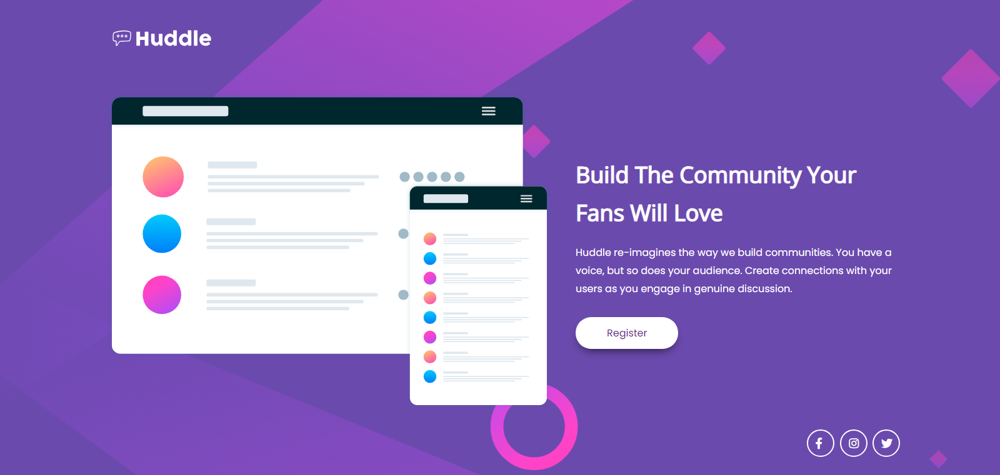

# Frontend Mentor - Huddle landing page with single introductory section solution

This is a solution to the [Huddle landing page with single introductory section challenge on Frontend Mentor](https://www.frontendmentor.io/challenges/huddle-landing-page-with-a-single-introductory-section-B_2Wvxgi0). Frontend Mentor challenges help you improve your coding skills by building realistic projects. 

## Table of contents

- [Overview](#overview)
  - [The challenge](#the-challenge)
  - [Screenshot](#screenshot)
  - [Links](#links)
- [My process](#my-process)
  - [Built with](#built-with)
  - [What I learned](#what-i-learned)
  - [Continued development](#continued-development)
  - [Useful resources](#useful-resources)
- [Author](#author)

## Overview

### The challenge

Users should be able to:

- View the optimal layout for the page depending on their device's screen size
- See hover states for all interactive elements on the page

### Screenshot



### Links

- Solution URL: (https://www.frontendmentor.io/solutions/responsive-huddle-landing-page-using-flexbox-qWPBjhyuAk#comment-649fe3b08eee0b70218b3d4b)
- Live Site URL: (https://huddle-lp-fm.netlify.app)

## My process

### Built with

- Semantic HTML5 markup
- CSS custom properties
- Flexbox
- Mobile-first workflow

### What I learned

This is the recap of some of your major learnings while working through this project. I've learned how to make a landmarks and aria role of all section on html where the example is showed below:

```html
<!-- Header Section -->
      <section class="logo" aria-label="Header Section">
          
      </section>
```
<div class="main-image" role="img" aria-label="Huddle Mockups">
  
</div>
```

### Continued development

For further development, i will focus on building custom styling for two devices, perhaps learning how to create different image backgrounds with different styles on mobile and desktop. It is possible that I will learn and use frameworks for future challenges, such as Bootstrap, TailwindCSS, and others.

### Useful resources

- [Font Awesome](https://fontawesome.com/) - This resources helped me for buliding this landing page. I really liked this icons variants and will use it going forward.

## Author

- Website - [Wima Alif](https://www.wimaalif.my.id)
- Frontend Mentor - [@gntrr](https://www.frontendmentor.io/profile/gntrr)